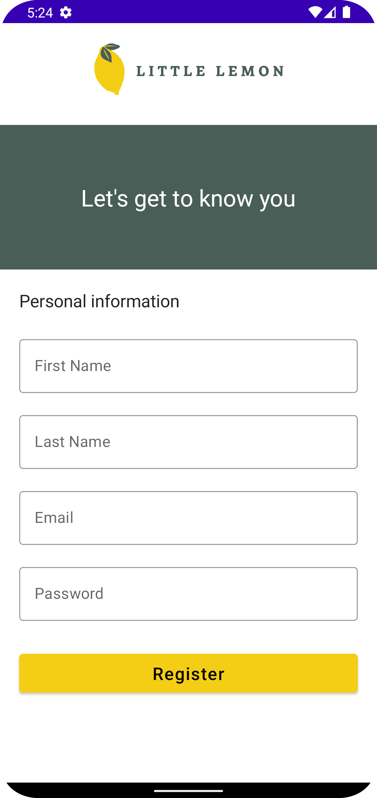

# meta_little_lemon
Start Date: 14th March 2023  
The capstone project from the Meta Android Developer Professional Certificate offered by Meta and Coursera. The app is a food ordering app designed for Android mobile devices.

# Goals
- To showcase my knowledge of Kotlin, Jetpack Compose, and Android Development
- To apply principles of UI/UX in designing the app and wireframe
- To design an onboarding process and a navigational flow that supports moving between screens
- To fetch data from the server and parse JSON file
- To store data in database (Room Database)
- To allow users to items using search phrase and selection

# Key Features
- Wireframe
- Onboarding Screen
- Fetching data from the server and parsing JSON file
- Room Database
- Filtering items

# Sample Images

